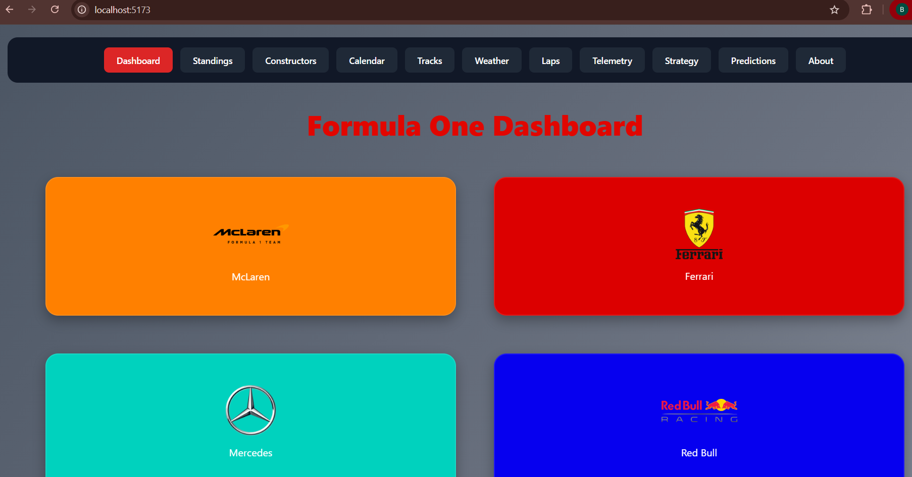

#  F1 Analytics Dashboard

A full-featured Formula 1 analytics dashboard built with React — combining live standings, race schedules, weather forecasts, telemetry, and lap time data with two custom-built tools: a pit strategy simulator and a race winner prediction model.

**[Live Demo](https://f1-dashboard-gamma-azure.vercel.app)**



---

## Features

- **Team & Driver Profiles** — Browse all 11 constructors with driver bios, career stats (wins, podiums, poles, championships), and car numbers
- **Driver Standings** — Live championship standings pulled from the current season
- **Constructor Standings** — Live team championship standings
- **Race Calendar** — Full season schedule with past/upcoming race indicators
- **Track Explorer** — Circuit details including length, lap count, and lap records
- **Race Weekend Weather** — Real weather data (temperature, humidity, rainfall, wind) for completed sessions
- **Lap Time Comparison** — Compare any two drivers' lap times across a race, visualized with an interactive chart
- **Telemetry** — Speed, throttle, and brake data visualization for individual drivers
- **Pit Strategy Simulator** — Rules-based tire strategy recommendations, with an "Auto" mode that pulls real rain forecasts for the next race
- **Race Winner Prediction** — A weighted statistical model that estimates win probability for the top 5 drivers based on current form

---

## Tech Stack

- **React + Vite** — component structure and build tooling
- **Tailwind CSS** — utility-first styling
- **Recharts** — lap time and telemetry data visualization
- **Vitest** — unit testing for core logic
- **Jolpica-F1 API** — driver/constructor standings, race calendar, results (Ergast API successor)
- **OpenF1 API** — session data, weather, lap times, car telemetry
- **Open-Meteo API** — race weekend rain probability forecasts

---

## How the Prediction Model Works

The Race Winner Prediction page uses a **weighted statistical scoring model** — not machine learning. Each driver's score combines:

- Championship points (60% weight)
- Constructor's points (30% weight)
- Standings position bonus (10% weight)

Scores are normalized and converted into relative win probabilities for the top 5 drivers. It's a transparent, explainable heuristic rather than a trained model, and it doesn't account for track-specific history, qualifying pace, or race-day incidents.

## How the Pit Strategy Simulator Works

A rules-based system that recommends a tire strategy based on:

- Race length (laps)
- Track-specific tire degradation (curated per-circuit estimates)
- Real rain forecast data (via Open-Meteo) for the next race on the calendar

High rain probability overrides fixed dry-tire strategy in favor of a reactive approach, matching how real F1 teams handle changeable conditions. An "Auto" mode automatically finds the next race and pulls its real forecast when the race is within ~16 days (the reliable forecast window).

---

## Data Accuracy Note

Live data (standings, calendar, weather, lap times, telemetry) comes directly from the APIs above and updates automatically. Driver career statistics and track degradation ratings are curated estimates, current as of mid-2026 season, and are not pulled from a live official source.

---

## Running Locally

```bash
git clone https://github.com/bhavana-ellur/f1-dashboard.git
cd f1-dashboard
npm install
npm run dev
```

Then open `http://localhost:5173` in your browser.

### Running Tests

```bash
npm test
```

---

## Project Structure

